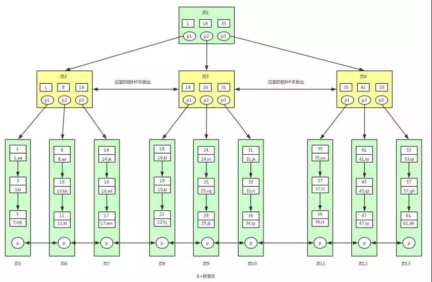

# 基础

### ACID 数据库的特征

数据库的基础特征

A:原子性（atomicity，或称不可分割性）

C:一致性（consistency）

I:隔离性（isolation，又称独立性）

D:持久性（durability）

### CAP 分布式系统的特征

Consistency:一致性

Availability:可用性

Partition tolerance:分区容错性

分区容错只是在小几率情况下发生，而且发生后优先考虑C 保证事务的一致性

### BASE

Basically Availabe(基本可用)

Soft state(软状态)

Eventually consistent(最终一致性)

是对CAP中一致性和可用性权衡的结果，是AP的补充，关注最终一致性。

### 康威定律 微服务架构

组织沟通方式会通过系统设计表达出来

时间再多一件事情也不可能做得完美，但总有时间做完一件事情

线型系统和线型组织架构间潜在的异质同态特性

大的系统组织总是比小系统更倾向于分解

### 2CP

**阶段一:提交事务请求(投票阶段)**

**阶段二:执行事务提交**

### 3CP

阶段一:CanCommit

阶段二:PreCommit

阶段三:doCommit,增加超时机制，防止阻塞

### Zookeeper和Paxos

* 组成Zookeeper集群的每台机器都会在`内存中维护当前的服务器状态`，并且`每台机器之间都相互保持通信`，只有`存在半数以上`的服务器才能对外提供服务。
* 顺序访问，每个客户端的每个更新请求，Zookeeper都会为其分配一个`全局唯一的递增编号`，其反映了所有事务操作的先后顺序。
* 高性能，Zookeeper将`全量数据存储在内存中`，并且直接服务于客户端的所有非事务请求，因此适用于`以读操作为主`的应用场景。

B+树 数据之间单链表，页之间双链表 ，3-4层 ，每个节点存100个ID 100\*100\*100= 10亿

<figure><figcaption></figcaption></figure>
